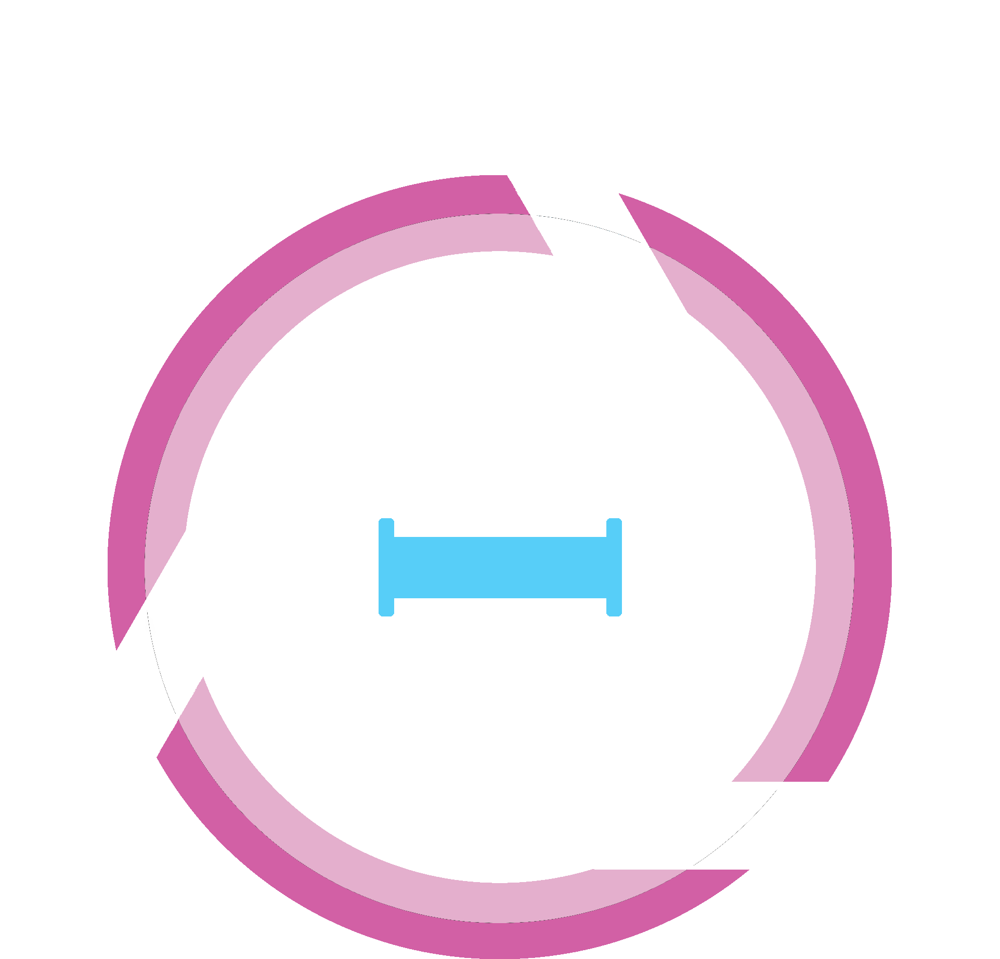
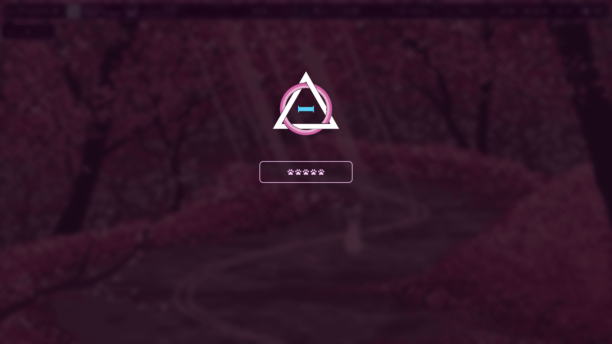
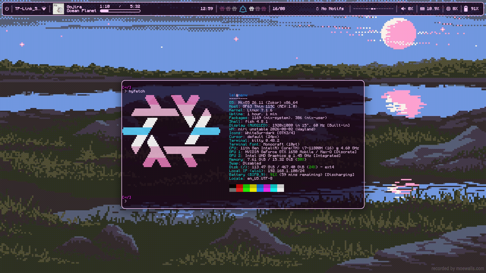
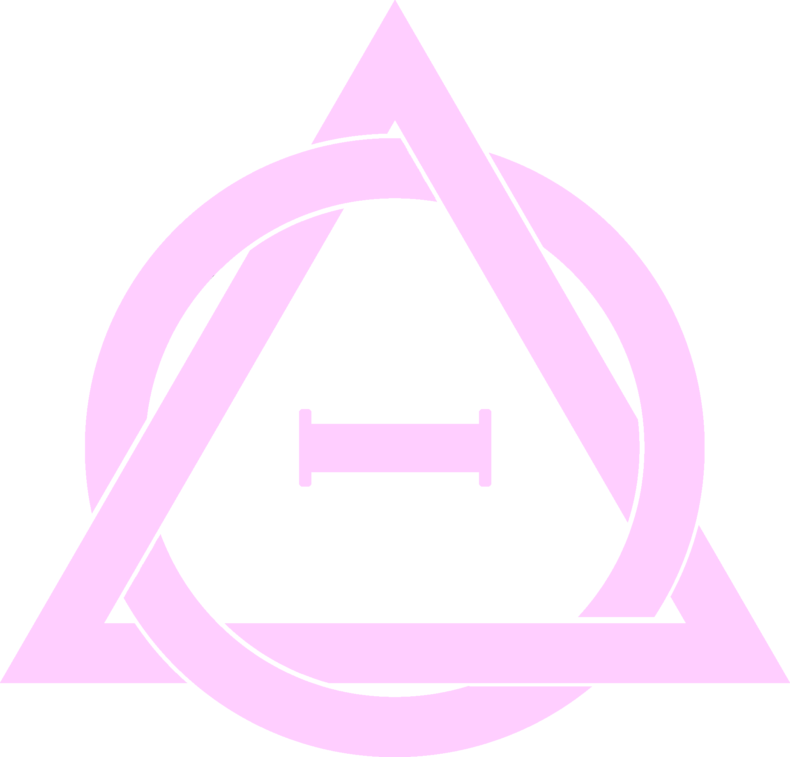

<div align="center">

</div>

<div align="center">
  
# Nixanthropy
</div>

### Screenshots

<table>
  <tr>
    <td></td>
    <td></td>
  </tr>
</table>

---

### Hosts


<table>
  <tr>
    <td>Name</td>
    <td>Desc</td>
    <td>Compositor</td>
    <td>Home-manager ?</td>
  </tr>
  <tr>
    <td>meow</td>
    <td>laptop</td>
    <td>niri</td>
    <td>✓</td>
  </tr>
  <tr>
    <td>shared</td>
    <td>shared</td>
    <td>N/A</td>
    <td>✓</td>
  </tr>
</table>

---

### Structure

files:
```text
.
├── flake.nix # points at hosts/<host>/<host>-main.nix  
├── packages/ 
├── assets/
│   ├── wallpapers/
│   ├── icons/
│   └── previews/
└── hosts/ 
    ├── meow/
    │   ├── meow-main.nix 
    │   ├── meow-home.nix 
    │   ├── home-manager/ 
    │   └── nix/
    └── shared/
        ├── shared-main.nix 
        ├── shared-home.nix 
        ├── home-manager/ 
        └── nix/

```

imports:
```text
.
└── flake.nix
    └── <host>-main.nix # host main imports its modules + shared main
        ├── <host>/nix/ 
        ├── <host>-home-nix # host home folder imports its modules + shared home
        │   ├── <host>/home-manager/
        │   └── shared/shared-home.nix
        │       └── shared/home-manager/
        └── shared-main.nix
            └── shared/nix/
```
---

### Credits
top bar: [ags paw-bar](https://github.com/catboylei/paw-bar)\
runner: [anyrun](https://github.com/anyrun-org/anyrun)\
anyrun options plugin: [anyrun-nixos-options](https://github.com/catboylei/anyrun-nixos-options) (personal fork)\
compositor: [niri flake](https://github.com/sodiboo/niri-flake)\
browser: [zen flake](https://github.com/0xc000022070/zen-browser-flake)\
formatter: [alejandra-opinionated](https://github.com/itsyunaya/alejandra-opinionated)\
shell: [fish](https://github.com/fish-shell/fish-shell)\
lockscreen: [hyprlock](https://github.com/hyprwm/hyprlock/)\
music player: [rmpc](https://github.com/mierak/rmpc)\
terminal: [kitty](https://github.com/kovidgoyal/kitty)

---

<div align="center">

</div>
